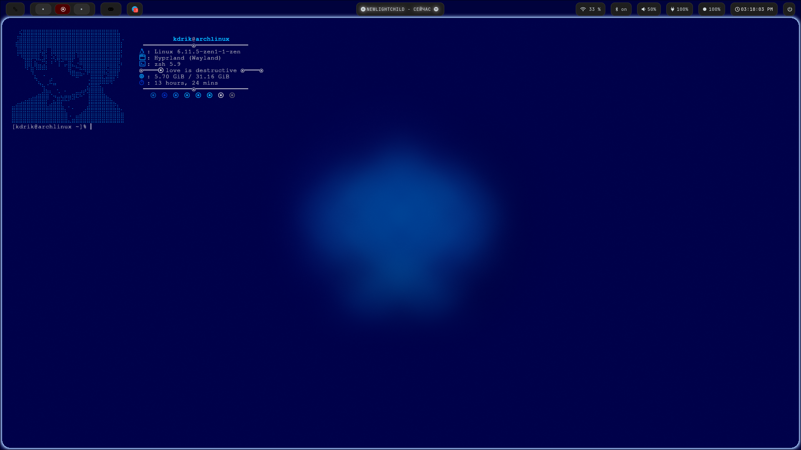
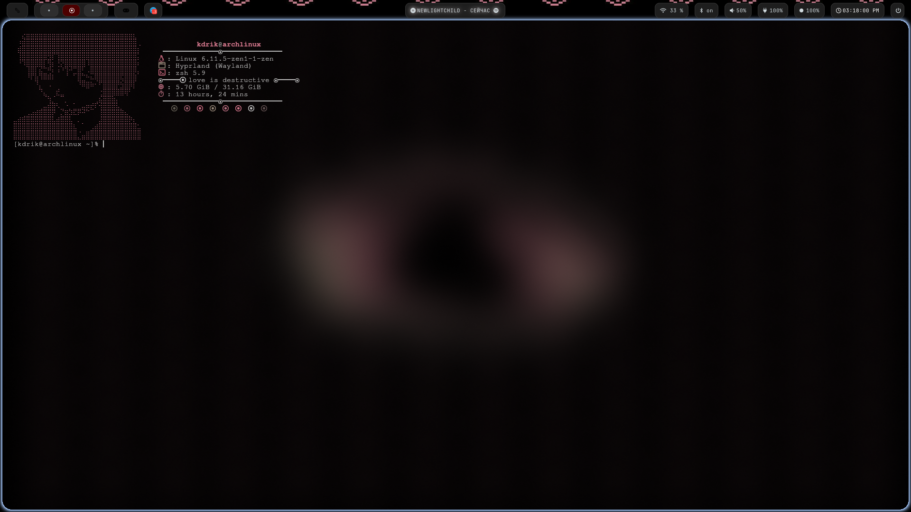

# hyprdots install

Enter this

```bash
git clone https://github.com/koyandrik/hyprdots.git
cd hyprdots
./run.sh
```

# binds

'''
super + c = kill process 

super + f = firefox

super + e = nautilus

super + h = full screen 

super + d = rofi(dmenu)

super + v = cliphist (alt+del - clear history)

super + m = quit session 

super + r = terminal kitty

```


# how to add wallpapers

Move your photo.jpg 
```
~/wallpapers
```

# my mini-site

coming soon.. (I don't know how to host flask)
<div align="center">
<table>
        <tr>
            <td></td>
            <td></td>
        </tr>
    </table>
</div>


## hello?


Hello, I'm new to Hyprland, but even so I would like to share my experience. 
I'm just starting to set up my environment and explore all the possibilities.

I'm currently trying to figure out the configuration
Therefore, I will continue to develop this topic further.


# Screenshot
<div align="center">
<table>
        <tr>
            <td></td>
            <td></td>
        </tr>
    </table>
</div>
